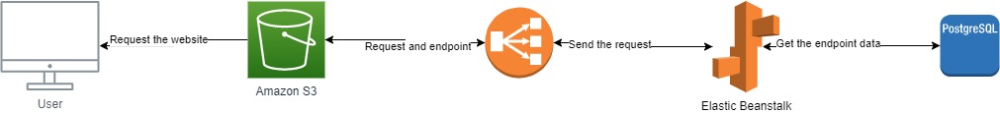

# Infrastructure

The fullstack app is build on three main basis

1. RDS **Database**
2. S3 **Frontend Hosting**
3. EB **API Server Hosting**

## RDS

---

RDS is a relational database service offered from AWS to host the database system configured with:

- **Postgres** 20GB

## S3

---

S3 is simple storage service offered by AWS to store the data in the form of Key and Object within a bucket with a unique name, it's used to store the code of the server application and can be used to as static host for our single page frontend application configured with:

- **Angular Js**

## EB

---

EB stands for elastic beanstalk, it's an orchestration service offered by AWS used to host the server application configured with:

- **Nodejs** as backend language works on Port 3000

## Architecture

