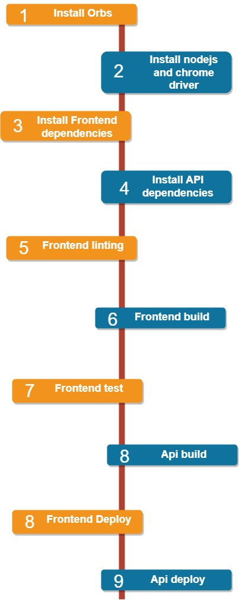

# Pipeline

Our CI/CD pipeline consists of multi steps divided to two stages build and deploy

## Orbs

```yml
orbs:
  node: circleci/node@5.0.3
  eb: circleci/aws-elastic-beanstalk@2.0.1
  aws-cli: circleci/aws-cli@3.1.1
  browser-tools: circleci/browser-tools@1.4.0
```

- node: install node for our server
- eb **elastic beanstalk**: install to deploy our application
- aws-cli: install to deploy our frontend application to s3
- browser-tools: install to run frontend test

## Build

```yml
- node/install:
        node-version: '16.15'
      # install chrome driver for the frontend testing
      - browser-tools/install-chrome
      - browser-tools/install-chromedriver
      - checkout
      # Use root level package.json to install dependencies in the frontend app
      - run:
          name: Install Front-End Dependencies
          command: |
            echo "NODE --version"
            echo $(node --version)
            echo "NPM --version"
            echo $(npm --version)
            npm run frontend:install
      - run:
          name: Install API Dependencies
          command: |
            echo "Installing dependencies in the the backend API  "
            npm run api:install
      - run:
          name: Front-End Lint
          command: |
            echo "Lint the frontend"
            npm run frontend:lint
      - run:
          name: Front-End Build
          command: |
            echo "Build the frontend app"
            npm run frontend:build
      - run:
          name: Front-End Testing
          command: |
            echo "Testing the frontend app"
            npm run frontend:test
      - run:
          name: API Build
          command: |
            echo "Build the backend API"
            npm run api:build
```

At the build stage we use run commands to run the commands along the pipeline

1. Install node js
2. Install the browser tools **chrome** for frontend testing
3. Install the frontend dependencies
4. Install api dependencies
5. Linting frontend code for more about [lint](https://www.perforce.com/blog/qac/what-lint-code-and-why-linting-important)
6. Build the frontend
7. Test the frontend
8. Build the backend code

## deploy

```yml
- node/install:
          node-version: '16.15'
      - eb/setup
      - aws-cli/setup
      - checkout
      - run:
          name: Deploy Frontend
          command: |
            echo "# Install, build, deploy in both apps"
            npm run frontend:install
            npm run frontend:build
            npm run frontend:deploy
      - run:
          name: Deploy Backend
          command: |
            echo "# Install, build, deploy in both apps"
            npm run api:install
            npm run api:build
            npm run api:deploy
```

At the deployment stage we here to deliver the code to our production servers and run it on, so we have the following steps:

1. Install node js
2. Install our eb and aws cli to deploy into eb and s3
3. Install then build the frontend
4. Deploy the frontend into s3 hosting using aws cli
5. Install then build our backend application
6. Deploy our backend using eb cli

## Workflow

```yml
- build
# Wait for the manual approval to proceed with deploy
- hold:
    filters:
      branches:
      only:
        - main
    type: approval
    requires:
      - build
# Deploy the application after the approval
- deploy:
    requires:
      - hold
```

The workflow controll how our pipeline will work so:

1. build our application frontend and backend
2. wait untill manually approved to proceed the next step
3. if approved, then deploy the application

## Enjoy our application ^^)

[Application Link](http://udagram-application.s3-website-us-east-1.amazonaws.com/)

## Diagram


